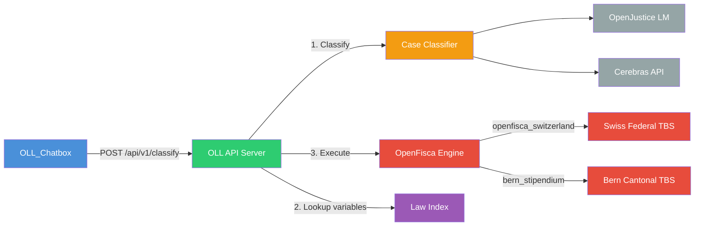

# OLL System Architecture

```mermaid
graph LR
    UI["OLL_Chatbox"]
    API["OLL API Server"]
    CLF["Case Classifier"]
    OFS["OpenFisca Engine"]
    LAWS["Law Index"]
    OJ["OpenJustice LM"]
    CB["Cerebras API"]

    UI -- "POST /api/v1/classify" --> API
    API -- "1. Classify" --> CLF
    API -- "2. Lookup variables" --> LAWS
    API -- "3. Execute" --> OFS
    CLF --> OJ
    CLF --> CB
    OFS -- "openfisca_switzerland" --> TBS1["Swiss Federal TBS"]
    OFS -- "bern_stipendium" --> TBS2["Bern Cantonal TBS"]

    style UI fill:#4A90D9,color:#fff
    style API fill:#2ECC71,color:#fff
    style CLF fill:#F39C12,color:#fff
    style OFS fill:#E74C3C,color:#fff
    style LAWS fill:#9B59B6,color:#fff
    style OJ fill:#95A5A6,color:#fff
    style CB fill:#95A5A6,color:#fff
    style TBS1 fill:#E74C3C,color:#fff
    style TBS2 fill:#E74C3C,color:#fff
```

## DSPy Optimization Process

```mermaid
graph LR
    EX["Gold Examples"] --> BOOT["BootstrapFewShot"]
    BOOT --> LLM["LLM Module"]
    LLM --> VAL["Validate + Execute"]
    VAL -- "fail" --> LLM
    VAL -- "pass" --> METRIC["Score"]
    METRIC --> BOOT

    style EX fill:#9B59B6,color:#fff
    style BOOT fill:#4A90D9,color:#fff
    style LLM fill:#F39C12,color:#fff
    style VAL fill:#2ECC71,color:#fff
    style METRIC fill:#E74C3C,color:#fff
```
